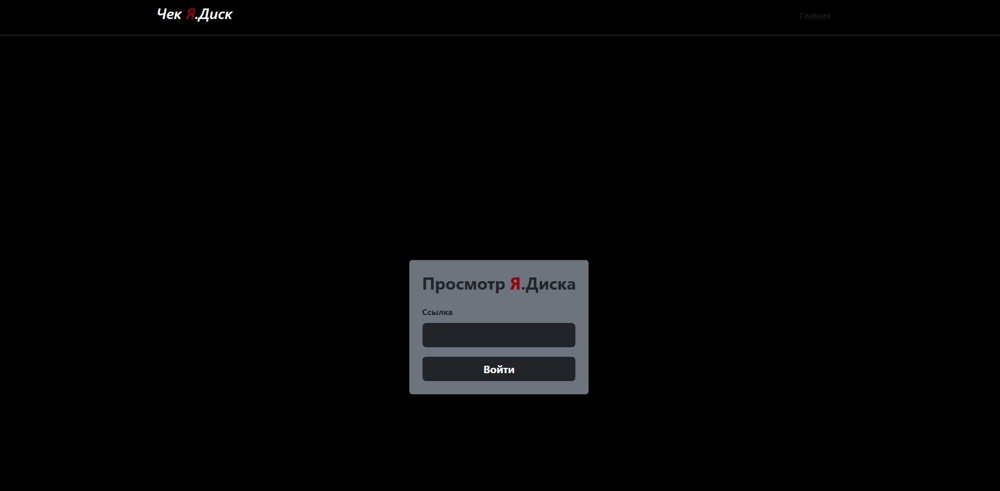
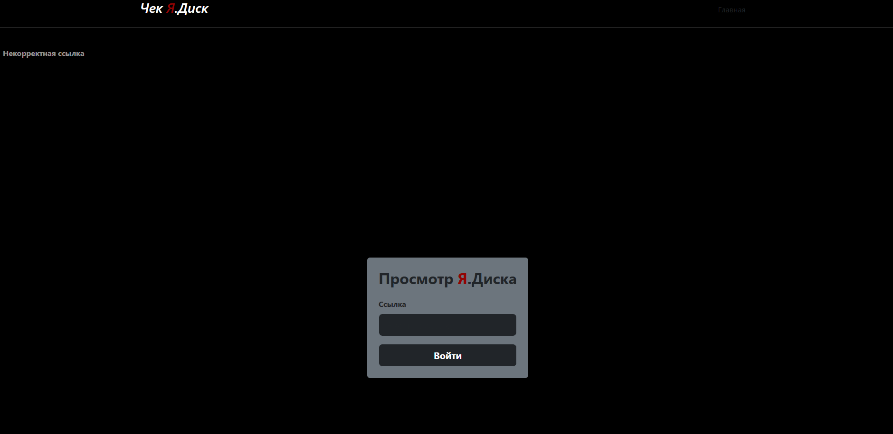
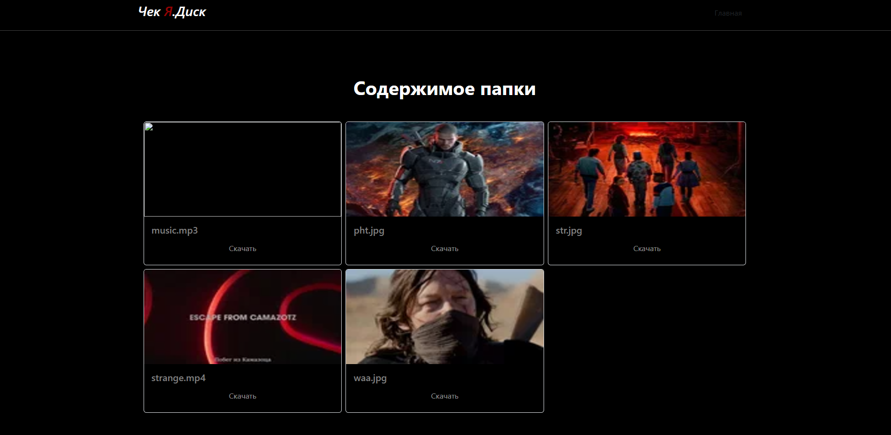
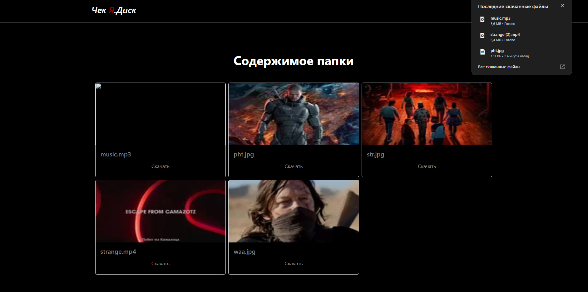

# Веб-приложение на Django, которое взаимодействует с API Яндекс.Диска.

1.	При наличии публичной ссылки (открытая, без пароля), пользователь может смотреть файлы, которые хранятся в папке Я.Диска.
2.  Пользователь имеет возможность выбирать файлы из списка и загружать их на свой локальный компьютер через интерфейс веб-приложения.

### Как запустить проект на локальной машине:
###### Клонировать репозиторий и перейти в него в командной строке:
`git clone https://github.com/Igor-L12/Cat-Y.Disk.git`
`cd mydisk`
###### Создать и активировать виртуальное окружение:
`python -m venv venv`
`. venv/Scripts/activate`
###### Установить зависимости из файла requirements.txt:
`pip install -r requirements.txt`
###### Запустить проект:
`python manage.py runserver`

## Что сделано:

### Страница входа, где надо ввести публичную ссылку:

### Отображение предупреждения при вводе некорректной ссылки:

### Страница содержимого с возможностью скачать каждый файл на локальный компьютер:

### Успешно скачанный файл:

## Технологический стек: 

- Python 
- Django

## Доп. стек:

- Bootstrap 5
- requests
- python-magic

Автор: [Игорь Л.](https://github.com/Igor-L12)